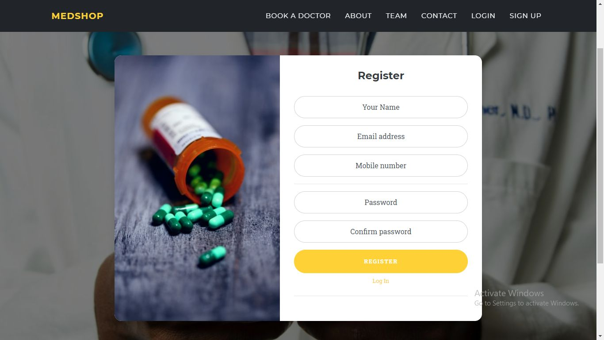

# Medshop, a doctor booking Web Application
# Demo URL
https://wildwingsindia.in/medical/

# Introduction
Outside the hospitals and doctor chambers, medical clinics are a place where most of the patients usually used to make an appointment with a doctor. 'Medshop' is a web application for booking an appointment with a doctor in respective clinics in the respective city. It will help the clinics to reduce crowd in this COVID 19 pandemic. 

The app contains 4 layers: User/Patient, Clinic, Doctor and Employee.  All layers have a separate login/registration facilities.

In the user portal, the user can search the doctor according to the required specialization within a selected area. The search result will contain a list of clinics which contain the doctor with required specialisation. The user can browse one of the clinics where a list of doctor with needed specialisation can be discovered. The user can choose one of them to make an appointment. Then, the user needs to provide some information like personal details, the problem with which he/she is suffering, previous medical records etc. In this step, the customer also has to choose the preferred slot of appointment. To finalize the booking, the customer has to pay a booking charge. After payment, a token will be generated with necessary booking information. Using the 'token status' option, the patient can check the status of the token anytime. According to the sequence number in the token, the patient has to visit the clinic for the checkup.  
In the clinic portal, the list doctor in the clinic with their specialisation and visiting time will be available. Through the 'view patients' option, a list of patients of respective doctors can be viewed according to the date. So that clinic can notify the user if anyone booked and then missed their appointment. 
In doctor portal, the doctors can browse a list of clinic where he/she used to visit. After selecting a clinic, the doctor will be able to see the list of patients who made their appointment. The doctor will be able to view the problems of each patient and also can spectate the previous prescription. It will help the doctor to set up a plan to treat the patient if there is a major concern. 
In the employee portal, the employee can approve the clinic and doctor. They will also able to assign a doctor in a clinic. They can also set/edit number of slot, date-and-time, charge of doctor etc. They will also provide necessary customer care services.

Successful launching of this application will not only help the medical shops to organise their customer but also will help the doctor to know their patients prior to their consultation. In addition, the customer/patient will also able to understand where, when and which doctor is available for consultation.

# Screenshot with working Steps
Home Page

 
Login for User
 
 
Login for Doctor
 
 
Login for Clinic
 
 
User searching for Doctor
 
 
User searching for Doctor
 
 
Search result of clinics that contain the doctor with required specialization
 
